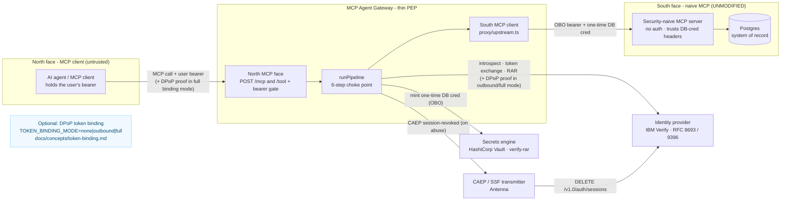

# MCP Agent Gateway - Verify + Vault

> **Your MCP server has no authorization. Put this in front of it. Change no code.**

A drop-in policy-enforcement gateway that sits between any AI agent and any MCP server and
injects per-call authorization the upstream server lacks: token introspection, tier-based
policy gates, OAuth 2.0 Token Exchange (RFC 8693) with Rich Authorization Requests (RFC 9396),
ephemeral least-privilege database credentials from HashiCorp Vault, policy-driven
human-in-the-loop step-up, and a per-call audit chain with CAEP/SSF session kill. The MCP
server it protects is never modified and never learns any of this happened.

[](.github/workflows/ci.yml)
[](docs/guides/quickstart.md#testing-offline)
[](package.json)
[](LICENSE)
[](docs/concepts/token-exchange-and-rar.md)

> **Disclaimer - personal project, not IBM software.** This repository is a personal project by
> rgraham@us.ibm.com, built for testing and demonstration purposes only. It is NOT an IBM product,
> NOT IBM-supported software, and NOT a supported IBM deployment or code offering. It is not meant
> to be used in production, and no support, warranty, or maintenance commitment is implied.

> **Updated for the MCP 2026-07-28 specification (August 2026).** SEP-2243 `Mcp-Method`/`Mcp-Name`
> header validation, `server/discover` support, HMAC-integrity `requestState` on human-approval
> flows (SEP-2322), and a trusted `X-User-Email` hint on both transports. Wire protocol stays
> 2025-11-25 until the SDK catches up: see [adoption status](docs/reference/mcp-2026-07-28.md).

---

## The problem it solves

Most MCP servers ship with no authorization at all. The server holds one standing credential,
usually a static database password in an environment file, and every tool call from every
caller executes with that credential's full privilege. Agent frameworks add reasoning on top,
not authorization: the agent decides *what* to call, and nothing decides *whether the signed-in
user is allowed to*.

The consequences compound. Every caller is the same superuser. There is no per-user least
privilege, no way to require human approval for a sensitive read, no credential that expires
when the call ends, and no audit record that ties a database query back to a person. Revoking
one user means rotating the shared secret for everyone.

| | Naive MCP (typical today) | Behind the gateway |
|---|---|---|
| Identity at the data layer | one shared static credential | per-call, per-user ephemeral credential |
| Authorization decision | none | your identity provider's access policy, per call |
| Sensitive actions | indistinguishable from routine ones | policy-driven step-up (push to the user's phone) |
| Credential lifetime | until someone rotates it | ~5 minutes, revoked when the call returns |
| Audit trail | server logs, no user attribution | per-call chain: user, agent, token `jti`, Vault lease |
| Compromised agent blast radius | everything the server can reach | the tier + policy ceiling for that one user |

The gateway closes this gap without touching the upstream server. The requirement that user
authority reach the data layer is satisfied at Vault, not at the MCP.

---

## Mental model

Think of the gateway as an MCP server on one side and an MCP client on the other, with an
authorization pipeline in between.

Your agent connects to the gateway exactly as it would to any MCP server, presenting the
signed-in user's OAuth bearer token. The gateway intercepts every tool call, establishes who
is calling and whether policy allows this specific action, then makes the same tool call
against the real MCP server southbound. What it injects on that southbound call is what the
naive server could never produce itself: a short-lived on-behalf-of token scoped to this one
action, and a one-time database credential minted for this one call.

Three things follow from this placement. The agent never holds database credentials, Vault
tokens, or signing authority, so a compromised or over-eager agent is bounded by policy. The
upstream MCP server never handles OAuth, so it needs zero changes. And every decision that
matters is made by your identity provider, not by the gateway.

That last point is deliberate. The gateway is a policy-enforcement point, not a policy engine.
It does not decide whether MFA is required or whether a record is visible; your IdP's access
policy and your system of record do. The gateway enforces those verdicts, brokers the
credentials, and refuses to absorb authorization logic. That discipline is what keeps it thin
enough to reuse across domains.

---

## How it works

Every tool call, whether it arrives as a real MCP `tools/call` or a plain REST `POST /tool`,
funnels through one choke point: `runPipeline`. Six steps, in order:

1. **Introspect.** The caller's bearer goes to the identity provider (`/oauth2/userinfo`):
   who is this, and is the session still active? A dead IdP is treated exactly like a revoked
   session. Fail closed.
2. **Kill-gate.** A local check against sessions the gateway itself revoked. This covers the
   30–75 second window between a CAEP event and the IdP's revocation propagating. Killed
   session → 401, immediately.
3. **Tier gate.** `config/tools.json` maps every tool to a tier. Tier 4 tools and unknown
   tools are denied here, with a deterministic 403, before the identity provider is ever
   contacted for an exchange.
4. **Exchange + RAR.** The gateway performs an OAuth 2.0 Token Exchange (RFC 8693): subject =
   the user's token, actor = the gateway's SPIFFE workload identity. The request carries
   `authorization_details` (RFC 9396) describing the exact action, so the IdP's policy sees
   "read record classification: restricted", not just "some API call". The IdP may return a
   scoped on-behalf-of token, or `scope=mfa_challenge`, which parks the call and pushes an
   approval to the user's phone.
5. **Vault mint.** The on-behalf-of token goes to Vault as `X-Vault-Token`. The `verify-rar`
   secrets engine validates it, matches the RAR against its role mappings, and mints a
   Postgres credential with a ~5-minute lease. No RAR match, no credential.
6. **Upstream + teardown.** The gateway calls the real MCP server with the on-behalf-of token
   and the ephemeral credential, revokes the Vault lease in a `finally` block, and appends the
   audit record. The lease never outlives its one call.

Each step is dependency-injected, so the whole pipeline unit-tests with zero network
(`npm test` makes no live calls).

The *why* behind each step: [architecture](docs/concepts/architecture.md) ·
[token exchange & RAR](docs/concepts/token-exchange-and-rar.md) ·
[human-in-the-loop](docs/concepts/human-in-the-loop.md) ·
[session kill](docs/concepts/session-kill.md) ·
[observability](docs/concepts/observability.md)

---

## Core security properties

- **Secretless execution.** No static database credentials anywhere in the call path. The
  agent holds only the user's bearer; the upstream MCP receives a credential that dies with
  the call.
- **Per-call authorization.** Every tool call is introspected, tier-gated, and exchanged.
  There is no session-level "already authorized" shortcut.
- **Ephemeral credentials.** Vault mints a fresh least-privilege Postgres credential per call
  (~5-minute lease) and the gateway revokes it on return, success or failure.
- **Human-in-the-loop the agent cannot skip.** Step-up is derived server-side from the data's
  classification, not requested by the caller. A restricted record is withheld until the
  user approves a push; there is no parameter the agent can set to bypass it.
- **Hard authorization boundaries.** Allow, deny, and MFA verdicts come from the identity
  provider's access policy. The gateway carries no policy logic to misconfigure or exploit.
- **Deterministic denies.** A policy denial is a 403 with a structured envelope, distinct
  from infrastructure failure. Unknown tools, unmatched RARs, and unreachable dependencies
  all fail closed.
- **End-to-end auditability.** Every call appends a record linking user, tool, tier, RAR,
  on-behalf-of token `jti`, and Vault lease id. Abuse triggers a CAEP `session-revoked` event
  over SSF, killing the user's IdP session tenant-wide.

---

## Architecture

The gateway speaks MCP on both faces. To the north it is an MCP server your agent connects to;
to the south it is an MCP client calling a deliberately security-naive MCP server, one with no
auth of its own. Between the two faces it injects the authorization the naive server lacks.



Northbound, the gateway is untrusting: it bearer-gates both endpoints and treats every caller
as potentially compromised. Southbound, it is the sole trusted caller of the naive MCP, and
everything it sends south (the on-behalf-of token, the one-time credential) was minted for
this single call.

Full walkthrough: [docs/concepts/architecture.md](docs/concepts/architecture.md). Five more
diagrams: [docs/diagrams/](docs/diagrams/index.md).

---

## Integration contract (for agent developers)

Nothing north of the gateway needs to know it exists. The contract is two lines:

1. **Present the user's OAuth bearer** - any access token from an OIDC login on your Verify
   tenant.
2. **Speak MCP or REST** - a real MCP `tools/call` on `POST /mcp`, or a plain
   `POST /tool {name, arguments}`.

A Claude loop, LangChain/LangGraph, the OpenAI Agents SDK, Strands, the Vercel AI SDK, a cron
job, or `curl` are all equivalent callers. The pipeline never knows or cares what reasoning
loop sits north of it.

There is exactly one integration rule, and it is about human approval, not transport:

> When a call returns **`202 { pending: true, txId, pushInfo }`**, a human approval is in
> flight: a push notification landed on the user's phone. Resolve it with
> `POST /hitl/complete { txId }` using the same user's bearer. Read the envelope, never the
> raw HTTP status, as the verdict; a `202` is a successful HTTP response carrying a parked
> call, so `res.ok` checks will sail right past it.

A caller that ignores `pending` doesn't break security. The record is withheld regardless; the
caller just can't complete step-up actions. Copy-paste client adapters (raw fetch, MCP SDK
client, a LangChain tool wrapper, a Claude custom-tool loop) are in
[docs/guides/any-agent.md](docs/guides/any-agent.md).

What the agent never receives, whatever its framework: database credentials, Vault tokens, or
the on-behalf-of token's signing authority.

---

## Quickstart

**What is local vs. external.** `docker compose up` brings up the local pieces: Postgres, the
naive example MCP, and the gateway. The security chain also calls two systems it does *not*
stand up for you: an IBM Verify tenant (token exchange + access policy) and a HashiCorp Vault
running the `verify-rar` plugin (ephemeral DB credentials). The bootstrap scripts wire your
tenant and Vault; see the [compose header](docker-compose.yml) for the exact split and the
[requirements note](#requirements-and-licensing) below.

```bash
# 1. Clone + install the workspace
git clone <this-repo> && cd mcp-gateway-verify-vault
npm install

# 2. Configure - copy the template and fill in Verify + Vault
cp .env.example .env
#   set at minimum: VERIFY_TENANT_URL, GATEWAY_EXCHANGE_CLIENT_ID,
#   GATEWAY_EXCHANGE_CLIENT_SECRET (env mode), VAULT_ADDR

# 3. Stand up the trust on YOUR tenant + Vault (idempotent; prints every id)
npm run bootstrap:verify        # apps, CELX attributes, access policy - all from config/
npm run bootstrap:vault         # verify-rar roles + OAuth-RS entities

# 4. Bring up Postgres + the naive MCP + the gateway.
#    Compose applies examples/db/*.sql automatically; for an EXTERNAL DB apply
#    examples/db/{schema,seed,naive-admin-role,vault-roles}.sql yourself.
docker compose up --build
```

Two calls prove the whole chain: a routine read, then a step-up read.

```bash
# A. Public record → 200 with the row AND the ephemeral cred that fetched it
curl -sS -X POST localhost:3014/tool \
  -H "Authorization: Bearer <user-access-token>" \
  -H 'Content-Type: application/json' \
  -d '{"name":"get_record","arguments":{"recordId":"REC-1001"}}'
# → 200 { "ok": true, "data": { ...record... },
#         "_diagnostic": { "oboJti": "...", "cred": { "username": "v-token-records-...", "leaseId": "...", "path": "verify-rar/creds/records" } } }

# B. Restricted record → 202 pending + a push to your phone (the gateway forces step-up)
curl -sS -X POST localhost:3014/tool \
  -H "Authorization: Bearer <user-access-token>" \
  -H 'Content-Type: application/json' \
  -d '{"name":"get_record","arguments":{"recordId":"REC-9001"}}'
# → 202 { "ok": false, "pending": true, "txId": "…", "pushInfo": { "title": "…", "message": "…" } }
# Approve the push, then:
curl -sS -X POST localhost:3014/hitl/complete \
  -H "Authorization: Bearer <user-access-token>" \
  -H 'Content-Type: application/json' -d '{"txId":"<from above>"}'
# → 200 { "ok": true, "data": { ...restricted record... }, "_diagnostic": { ... "cred": { "path": "verify-rar/creds/records-elevated" } } }
```

Notice two things. The caller never requested elevation: `REC-9001` is classified `restricted`
in the seed data, and the gateway derived the step-up server-side, so the agent cannot skip
it. And the response shows the one-time Vault credential that ran the query
(`_diagnostic.cred`), which is deliberate:
[invisible security reads as broken](docs/concepts/observability.md).

`npm run smoke` runs this end-to-end, positive and negative assertions both, against a running
gateway. Expanded walkthrough + troubleshooting:
[docs/guides/quickstart.md](docs/guides/quickstart.md). To verify the Verify/Vault trust
wiring before involving a database at all, start with the
[wire-check guide](docs/guides/wire-check.md).

### Requirements and licensing

- **Node ≥ 20** and Docker (for the local example stack).
- **An IBM Verify tenant** with an admin API client for bootstrap. The least-privilege
  entitlement floor is documented in
  [docs/reference/verify-api-entitlements.md](docs/reference/verify-api-entitlements.md); the
  runtime needs none of those, it rides the OIDC apps. Everything the gateway uses is standard
  Verify: OIDC apps, the token-exchange grant, access policies, CELX attributes.
- **HashiCorp Vault** with the `verify-rar` plugin (sister repo
  `vault-plugin-secrets-verify-rar`) and its OAuth-Resource-Server profile. The
  OAuth-RS/SPIFFE features are a licensed Vault capability; this is the one non-standard
  component. The `env`-secrets quickstart still needs Vault for the ephemeral DB creds; only
  the client-secret storage is optional there.

### Vault build compatibility

Vault Enterprise builds changed the field names their OAuth-RS evaluator reads inside each
`vault:path_access` authorization_details entry: 2.0.0-verify-alpha builds read
`path_constraint`/`action`, while **Vault Enterprise 2.0.4** reads `path`/`capabilities` and
contains zero occurrences of the alpha-era names - a leg carrying only the old shape is refused
with `RAR_NO_MATCH` on every mint. The gateway therefore emits **both field sets in every leg**
("dual shape", `gateway/src/rar/build-rar.ts`); the two sets always agree and each build ignores
the fields it does not know.

Verification status, per build:

- **Vault Enterprise 2.0.4** (`hashicorp/vault-enterprise:2.0.4-ent`): proven live (2026-08-09) -
  dual-shape legs mint, wrong-path and wrong-capability legs still refuse, and an entry carrying
  both field sets mints because 2.0.4 ignores the alpha fields.
- **2.0.0-verify-alpha builds**: the change is purely additive (the alpha fields are still
  emitted, unchanged), so no regression is expected, but a dual-shape mint has not yet been run
  live against an alpha build. Treat that direction as unverified until it has.

Two deployment notes: Verify must re-issue the added fields into the OBO. This repo's bootstrap
leaves authorization_details types unrestricted on the TE app (`restrictAuthDetailTypes: false`,
`bootstrap/verify.ts`), so dual-shape legs pass through with no tenant change; a tenant that has
locked down `authDetailTypes` schemas must allow `path`/`capabilities` on the `vault:path_access`
type once. And once no alpha-build Vault remains behind any deployment of this gateway, the
alpha-era fields can be dropped - the emission helper is the single place to collapse.

---

## Secure your own MCP

The core is generic; the domain is configuration. Everything that makes the example deployment
"records" lives in five swappable surfaces. The exchange/mint/HITL/SSF/audit core never
changes.

```mermaid
flowchart LR
    subgraph CORE["Generic core - ships unchanged (the product)"]
        direction TB
        C1["runPipeline - 6-step PEP"]
        C2["introspect · token-exchange · HITL step-up"]
        C3["vault mint / revoke"]
        C4["deny-counter · killed-sessions · antenna"]
        C5["audit chain · pending store"]
    end

    subgraph CFG["Per-domain config - swap to secure YOUR MCP"]
        direction TB
        S1["config/tools.json<br/>tier map (data, not code)"]
        S2["config/rar.json<br/>RAR vocabulary + role collapse"]
        S3["UPSTREAM_MCP_URL<br/>upstream MCP endpoint (env)"]
        S4["IdP: Verify TE app + access policy<br/>+ CELX attributes"]
        S5["Secrets: Vault verify-rar roles<br/>+ DB grants"]
    end

    CFG -. "injected via env + config + IdP/Vault trust" .-> CORE
    CORE ==> OUT["A newly secured domain<br/>same core, new trust config"]
```



| # | Surface | Where | What changes |
|---|---|---|---|
| 1 | Upstream MCP URL | `UPSTREAM_MCP_URL` env (`proxy/upstream.ts`) | Point the south face at any naive MCP's `/mcp`. |
| 2 | Tier map | `config/tools.json` | One JSON object: `tool → { tier, rarAction, scope }`. Data only. |
| 3 | RAR vocabulary | `config/rar.json` | The business RAR `type`, the action→role collapse, the Vault creds paths. Data only, no code seam. |
| 4 | IdP trust config | `bootstrap/verify.ts` (generated from 1–3) | Token-exchange app, per-tier step-up policy, CELX attributes. |
| 5 | Secrets-engine roles | `bootstrap/vault.ts` (generated from 3) | One `verify-rar` role per creds path + DB grants + OAuth-RS entities. |

A new domain = edit two JSON files + run two bootstrap scripts. Zero application code. The
long pole, as every operator reports, is the per-downstream *trust* configuration (surfaces
4–5); budget for that, not the code. A worked "records → your domain" example:
[docs/guides/bring-your-own-mcp.md](docs/guides/bring-your-own-mcp.md).

---

## Operational considerations

**Secrets backend.** The gateway authenticates to Verify's `/oauth2/token` with two OAuth
client secrets. Where those secrets live is one flag, `SECRETS_BACKEND`. In `env` mode (the
default) they sit plaintext in your `.env`: zero extra infrastructure, local evaluation only.
In `vault` mode, recommended for anything shared, the gateway holds only an AppRole/SPIFFE
identity and reads the client secret live from the IBM Verify Vault plugin, which rotates it
on every read. Nothing sensitive at rest, and a leaked value goes stale almost immediately.
Threat model and the `env → vault` migration: [docs/guides/secrets.md](docs/guides/secrets.md).

**Token binding (DPoP, RFC 9449).** One env var, `TOKEN_BINDING_MODE`, controls
proof-of-possession. `outbound` binds the on-behalf-of tokens to the gateway's key;
`full` additionally requires caller-signed proofs on every northbound request, so a stolen
token is useless without the private key. Off by default, and `none` mode is byte-identical
to not having the feature. See [docs/concepts/token-binding.md](docs/concepts/token-binding.md)
and the [rollout guide](docs/guides/dpop-rollout.md).

**Failure modes.** The pipeline fails closed at every dependency. An unreachable IdP is
treated as a revoked session (401), not a pass-through. An unknown tool or tier-4 tool is a
403 before any network call. A RAR with no matching Vault role mint is a denial, not a
fallback to a broader credential. The step-up classifier fails closed too: if the discovery
probe can't determine a record's classification, the gateway elevates. And leases are revoked
in a `finally`, so an upstream crash cannot leave a live database credential behind.
Repeated denials increment a per-user counter that triggers the CAEP session kill; see
[session kill](docs/concepts/session-kill.md).

---

## Docs map

- **Concepts (the why)** - [architecture](docs/concepts/architecture.md) ·
  [token exchange & RAR](docs/concepts/token-exchange-and-rar.md) ·
  [human-in-the-loop](docs/concepts/human-in-the-loop.md) ·
  [session kill](docs/concepts/session-kill.md) ·
  [observability](docs/concepts/observability.md) ·
  [token binding](docs/concepts/token-binding.md)
- **Guides (the how)** - [quickstart](docs/guides/quickstart.md) ·
  [wire-check (Phase 0, no DB)](docs/guides/wire-check.md) ·
  [bring your own MCP](docs/guides/bring-your-own-mcp.md) ·
  [any agent](docs/guides/any-agent.md) · [Claude tunnels](docs/guides/claude-tunnels.md) ·
  [add a tool](docs/guides/add-a-tool.md) · [step-up policies](docs/guides/step-up-policies.md) ·
  [session kill](docs/guides/session-kill.md) · [secrets](docs/guides/secrets.md) ·
  [DPoP rollout](docs/guides/dpop-rollout.md) · [deploy on RHEL](docs/guides/deploy-on-rhel.md)
- **Reference** - [configuration (every env var)](docs/reference/configuration.md) ·
  [API + envelope contract](docs/reference/api.md) ·
  [Verify API entitlements](docs/reference/verify-api-entitlements.md) ·
  [troubleshooting](docs/reference/troubleshooting.md)
- [Threat model](docs/threat-model.md) · [Diagrams](docs/diagrams/index.md) ·
  [Bootstrap run order](bootstrap/README.md)

## Testing

`npm test` runs the whole suite offline, not one live network call, thanks to dependency
injection everywhere. `npm run typecheck` is the strict `tsc` pass; `npm run lint:words` is
the customer-shareable forbidden-words scan CI enforces.

## Support

Open an issue on the repository. For security-sensitive reports, flag the issue privately to
the maintainers rather than filing a public issue.

**Maintainer:** Robert Graham - rgraham@us.ibm.com
