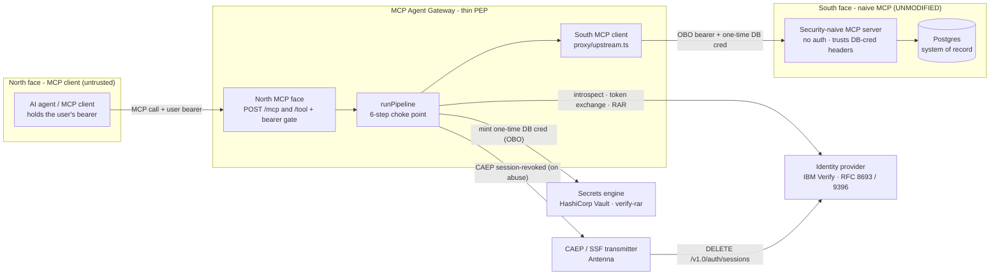

# MCP Agent Gateway - Verify + Vault

> **Your MCP server has no authorization. Put this in front of it - change no code.**

A drop-in, MCP-terminating security gateway that adds a full per-call, policy-enforced
authorization chain in front of **any** MCP server: session introspection, a per-tool tier
gate, **RFC 8693 Token Exchange** with **RFC 9396 Rich Authorization Requests**, **ephemeral
one-time database credentials** brokered from HashiCorp Vault, **policy-driven human-in-the-loop**
step-up, and **CAEP/SSF** session kill - emitted as a per-call, per-user audit chain. The MCP
server it protects never learns any of this happened.

[](.github/workflows/ci.yml)
[](docs/guides/quickstart.md#testing-offline)
[](package.json)
[](LICENSE)
[](docs/concepts/token-exchange-and-rar.md)

The gateway is a **policy-enforcement point (PEP)**, not a policy engine. It does not *decide*
whether MFA is required or whether a row is visible - your identity provider's access policy and
your system of record do. The gateway enforces those verdicts and brokers the credentials, and
refuses to absorb authorization logic. That discipline is what keeps it thin and reusable.

> **The thesis.** You can drop this in front of an MCP server that does **zero** auth, and the
> user's authority still reaches the data layer as a short-lived, least-privilege credential -
> without the naive MCP ever having to understand tokens. The token-for-OBO-actions requirement
> is satisfied **at Vault, not at the MCP**.

---

## Works with any agent

**Nothing north of the gateway needs to know it exists.** The north-face contract is two lines:

1. **Present the user's OAuth bearer** - any access token from an OIDC login on your Verify tenant.
2. **Speak MCP or REST** - a real MCP `tools/call` on `POST /mcp`, *or* a plain `POST /tool
   {name, arguments}`.

That's the whole contract. A **Claude** loop, **LangChain**/LangGraph, the **OpenAI Agents**
SDK, **Strands**, the **Vercel AI SDK**, a cron job, or `curl` are all equivalent callers - the
pipeline never knows or cares what reasoning loop sits north of it.

There is exactly **one** integration rule, and it is about human approval, not transport:

> When a call comes back **`202 { pending: true, txId, pushInfo }`**, a human approval is in
> flight (a push landed on the user's phone). Resolve it with **`POST /hitl/complete { txId }`**
> using the same user's bearer. Read the **envelope**, never the raw HTTP status, as the verdict.

A caller that ignores `pending` doesn't break security - the record is withheld regardless. It
just can't complete step-up actions. Copy-paste client adapters (raw fetch, MCP SDK client, a
LangChain tool wrapper, a Claude custom-tool loop) are in **[docs/guides/any-agent.md](docs/guides/any-agent.md)**.

What the agent **never** gets, whatever its brand: database credentials, Vault tokens, or the
OBO's signing authority. An over-eager or compromised agent is bounded by tier + RAR + policy.

---

## Architecture

The gateway speaks MCP on **both faces**. To the north it is an MCP server your agent connects
to; to the south it is an MCP client that calls a deliberately *security-naive* MCP server - one
with no auth of its own. Between the two faces it injects the authorization the naive server lacks.



Full walkthrough: **[docs/concepts/architecture.md](docs/concepts/architecture.md)**. The other
five diagrams live in **[docs/diagrams/](docs/diagrams/index.md)**.

---

## 5-minute quickstart

**What you need first.** The gateway's security chain calls two systems it does **not** stand up
for you: an **IBM Verify tenant** (token exchange + policy) and a **HashiCorp Vault** with the
`verify-rar` plugin (ephemeral DB creds). `docker compose up` brings up the local pieces
(Postgres + the naive MCP + the gateway); the bootstrap scripts wire your tenant + Vault. See the
[compose header](docker-compose.yml) for exactly what is local vs. external, and the
[licensing note](#requirements--licensing) below.

```bash
# 1. Clone + install the workspace
git clone <this-repo> && cd mcp-gateway-verify-vault
npm install

# 2. Configure - copy the template and fill in Verify + Vault
cp .env.example .env
#   set at minimum: VERIFY_TENANT_URL, GATEWAY_EXCHANGE_CLIENT_ID,
#   GATEWAY_EXCHANGE_CLIENT_SECRET (env mode), VAULT_ADDR

# 3. Stand up the trust on YOUR tenant + Vault (idempotent; prints every id)
npm run bootstrap:verify        # apps, CELX attributes, access policy - all from config/
npm run bootstrap:vault         # verify-rar roles + OAuth-RS entities

# 4. Bring up Postgres + the naive MCP + the gateway.
#    Compose applies examples/db/*.sql automatically; for an EXTERNAL DB apply
#    examples/db/{schema,seed,naive-admin-role,vault-roles}.sql yourself.
docker compose up --build
```

Now two calls prove the whole chain - a routine read, and a step-up read:

```bash
# A. Public record → 200 with the row AND the ephemeral cred that fetched it
curl -sS -X POST localhost:3014/tool \
  -H "Authorization: Bearer <user-access-token>" \
  -H 'Content-Type: application/json' \
  -d '{"name":"get_record","arguments":{"recordId":"REC-1001"}}'
# → 200 { "ok": true, "data": { ...record... },
#         "_diagnostic": { "oboJti": "...", "cred": { "username": "v-token-records-...", "leaseId": "...", "path": "verify-rar/creds/records" } } }

# B. Restricted record → 202 pending + a push to your phone (the gateway forces step-up)
curl -sS -X POST localhost:3014/tool \
  -H "Authorization: Bearer <user-access-token>" \
  -H 'Content-Type: application/json' \
  -d '{"name":"get_record","arguments":{"recordId":"REC-9001"}}'
# → 202 { "ok": false, "pending": true, "txId": "…", "pushInfo": { "title": "…", "message": "…" } }
# Approve the push, then:
curl -sS -X POST localhost:3014/hitl/complete \
  -H "Authorization: Bearer <user-access-token>" \
  -H 'Content-Type: application/json' -d '{"txId":"<from above>"}'
# → 200 { "ok": true, "data": { ...restricted record... }, "_diagnostic": { ... "cred": { "path": "verify-rar/creds/records-elevated" } } }
```

Notice: **the caller never requested elevation.** `REC-9001` is classified `restricted` in the seed
data, and the gateway *derived* the step-up server-side - the agent cannot skip it. And the response *shows* the
one-time Vault credential that ran the query (`_diagnostic.cred`), which is deliberate:
[invisible security reads as broken](docs/concepts/observability.md).

`npm run smoke` runs this end-to-end (positive **and** negative) against a running gateway.
Expanded walkthrough + troubleshooting: **[docs/guides/quickstart.md](docs/guides/quickstart.md)**.

---

## How it works - the six steps

Every tool call, `/mcp` or `/tool`, funnels through one choke point (`runPipeline`). Each stage
is [dependency-injected](docs/guides/quickstart.md#testing-offline), so the whole thing unit-tests with
zero network.

| # | Step | What happens | Fails how |
|---|---|---|---|
| 1 | **Introspect** | `GET /oauth2/userinfo` with the caller's bearer → who is this, still active? | **Fail-closed** - a dead IdP is treated exactly like a revoked session. |
| 0 | **Kill-gate** | `isSessionKilled(sub)`? Covers the 30–75s CAEP → Verify revoke-propagation window. | 401 immediately. |
| 2 | **Tier gate** | `config/tools.json`: tier 4 = deny, unknown tool = deny - **before Verify is ever contacted**. | 403 denied. |
| 3 | **Exchange + RAR** | RFC 8693 exchange (subject = user, actor = gateway SPIFFE SVID) carrying RFC 9396 `authorization_details`. | `mfa_challenge` → step-up; else scoped OBO. |
| 4 | **Vault mint** | OBO POSTed as `X-Vault-Token`; `verify-rar` matches the RAR and mints a ~5-min Postgres cred. | denied if the RAR does not match a role mapping. |
| 5 | **Upstream + teardown** | Run the tool against the naive MCP with the OBO + ephemeral cred; **revoke the lease in a `finally`**; append the audit record. | lease never outlives its one call. |

- **Optional DPoP token binding (RFC 9449).** One env var (`TOKEN_BINDING_MODE`) binds the OBOs
  to the gateway's key, or goes further and requires caller-signed proofs on every request, so a
  stolen token is useless without the key. Off by default; `none` mode is byte-identical to not
  having the feature. See [docs/concepts/token-binding.md](docs/concepts/token-binding.md).

Read the *why* behind each: **[architecture](docs/concepts/architecture.md)** ·
**[token exchange & RAR](docs/concepts/token-exchange-and-rar.md)** ·
**[human-in-the-loop](docs/concepts/human-in-the-loop.md)** ·
**[session kill](docs/concepts/session-kill.md)** ·
**[observability](docs/concepts/observability.md)**.

---

## Secure your own MCP

The whole point: **the core is generic; the domain is configuration.** Everything that makes this
deployment "records" lives in five swappable surfaces. The exchange/mint/HITL/SSF/audit core never
changes.

```mermaid
flowchart LR
    subgraph CORE["Generic core - ships unchanged (the product)"]
        direction TB
        C1["runPipeline - 6-step PEP"]
        C2["introspect · token-exchange · HITL step-up"]
        C3["vault mint / revoke"]
        C4["deny-counter · killed-sessions · antenna"]
        C5["audit chain · pending store"]
    end

    subgraph CFG["Per-domain config - swap to secure YOUR MCP"]
        direction TB
        S1["config/tools.json<br/>tier map (data, not code)"]
        S2["config/rar.json<br/>RAR vocabulary + role collapse"]
        S3["UPSTREAM_MCP_URL<br/>upstream MCP endpoint (env)"]
        S4["IdP: Verify TE app + access policy<br/>+ CELX attributes"]
        S5["Secrets: Vault verify-rar roles<br/>+ DB grants"]
    end

    CFG -. "injected via env + config + IdP/Vault trust" .-> CORE
    CORE ==> OUT["A newly secured domain<br/>same core, new trust config"]
```



| # | Surface | Where | What changes |
|---|---|---|---|
| 1 | **Upstream MCP URL** | `UPSTREAM_MCP_URL` env (`proxy/upstream.ts`) | Point the south face at any naive MCP's `/mcp`. |
| 2 | **Tier map** | `config/tools.json` | One JSON object: `tool → { tier, rarAction, scope }`. Data-only. |
| 3 | **RAR vocabulary** | `config/rar.json` | The business RAR `type`, the action→role collapse, the Vault creds paths. **Data-only** - no code seam. |
| 4 | **IdP trust config** | `bootstrap/verify.ts` (generated from 1–3) | Token-exchange app, per-tier step-up policy, CELX attributes. |
| 5 | **Secrets-engine roles** | `bootstrap/vault.ts` (generated from 3) | One `verify-rar` role per creds path + DB grants + OAuth-RS entities. |

**A new domain = edit two JSON files + run two bootstrap scripts. Zero application code.** The
long pole, as every operator reports, is the per-downstream *trust* configuration (surfaces 4–5) -
budget for that, not the code. Worked "records → your domain" example:
**[docs/guides/bring-your-own-mcp.md](docs/guides/bring-your-own-mcp.md)**.

---

## Secrets: `.env` to start, Vault to ship

The gateway authenticates to Verify's `/oauth2/token` with two OAuth client secrets. Where those
secrets are read from is **one flag**, `SECRETS_BACKEND`:

- **`env` (default)** - plaintext in your `.env`. Zero extra infrastructure. **Local evaluation
  only** - the secret sits on disk until you manually rotate it.
- **`vault` (strongly recommended for anything shared)** - the gateway holds only an AppRole/SPIFFE
  identity and reads the client secret live from the IBM Verify Vault plugin, which **rotates it on
  every read**. Nothing sensitive at rest; a leaked value is stale almost immediately.

Full two-column threat model + the `env → vault` migration: **[docs/guides/secrets.md](docs/guides/secrets.md)**.

---

## Requirements & licensing

- **Node ≥ 20**, Docker (for the local example stack).
- **An IBM Verify tenant** with an admin API client for bootstrap. The exact least-privilege
  entitlement floor is **[docs/reference/verify-api-entitlements.md](docs/reference/verify-api-entitlements.md)**
  (the runtime needs **none** of those - it rides the OIDC apps). Everything the gateway uses is
  standard Verify: OIDC apps, the token-exchange grant, access policies, CELX attributes.
- **HashiCorp Vault** with the `verify-rar` plugin (sister repo
  `vault-plugin-secrets-verify-rar`) and its OAuth-Resource-Server profile. The OAuth-RS/SPIFFE
  features are a **licensed Vault** capability -
  this is the one non-standard component. The `env`-secrets quickstart still needs Vault for the
  ephemeral DB creds; only the *client-secret storage* is optional there.

---

## Docs map

- **Concepts (the *why*)** - [architecture](docs/concepts/architecture.md) ·
  [token exchange & RAR](docs/concepts/token-exchange-and-rar.md) ·
  [human-in-the-loop](docs/concepts/human-in-the-loop.md) ·
  [session kill](docs/concepts/session-kill.md) ·
  [observability](docs/concepts/observability.md) ·
  [token binding](docs/concepts/token-binding.md)
- **Guides (the *how*)** - [quickstart](docs/guides/quickstart.md) ·
  [wire-check (Phase 0, no-DB)](docs/guides/wire-check.md) ·
  [bring your own MCP](docs/guides/bring-your-own-mcp.md) ·
  [any agent](docs/guides/any-agent.md) · [Claude tunnels](docs/guides/claude-tunnels.md) ·
  [add a tool](docs/guides/add-a-tool.md) · [step-up policies](docs/guides/step-up-policies.md) ·
  [session kill](docs/guides/session-kill.md) · [secrets](docs/guides/secrets.md)
- **Reference** - [configuration (every env var)](docs/reference/configuration.md) ·
  [API + envelope contract](docs/reference/api.md) ·
  [Verify API entitlements](docs/reference/verify-api-entitlements.md) ·
  [troubleshooting](docs/reference/troubleshooting.md)
- **[Threat model](docs/threat-model.md)** · **[Diagrams](docs/diagrams/index.md)** ·
  **[Bootstrap run order](bootstrap/README.md)**

## Testing

`npm test` runs the whole suite offline - not one live network call, thanks to
dependency-injection everywhere. `npm run typecheck` is the strict `tsc` pass;
`npm run lint:words` is the customer-shareable forbidden-words scan CI enforces.

## Support

Open an issue on the repository. For security-sensitive reports, flag the issue privately to the
maintainers rather than filing a public issue.

**Maintainer:** Robert Graham - rgraham@us.ibm.com
