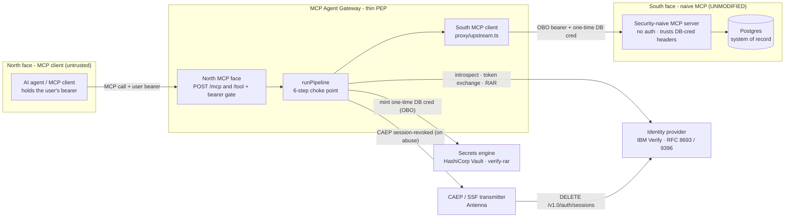
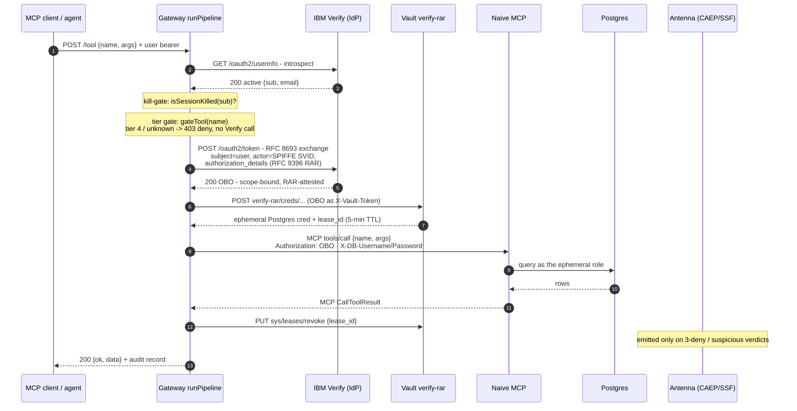

# Architecture - two MCP faces and the pipeline between them

This page explains *why* the gateway is shaped the way it is. If you want the copy-paste path,
start at the [quickstart](../guides/quickstart.md); come back here when you want to understand
what you just ran.

## The problem it exists to solve

A **naive MCP server** is the common case in the wild: it exposes tools over the Model Context
Protocol and does no authorization of its own. The bundled south-side server
([`examples/naive-mcp`](../../examples/naive-mcp)) is built that way *on purpose* - its
`resolvePool()` uses whatever `X-DB-Username` / `X-DB-Password` headers the caller forwards, and
**falls back to a single static admin credential** when they are absent. No token exchange, no
RAR, no per-request authorization, no ephemeral lease. That is not a bug in the reference server;
it is the control condition - "what most MCP integrations look like today."

Pushing authorization into every server author's hands has failed at near-universal rates. The
durable answer is a **thin policy-enforcement point (PEP)** in front of the server that
centralizes token exchange, credential brokering, and audit - while the authorization *semantics*
ride in the tokens (`sub` + `act` chain + `authorization_details`) and are decided by identity-
provider policy per tool. This gateway is a working implementation of that thesis.

The one discipline that makes it safe: **the gateway is a PEP, not a policy engine.** It does not
decide whether MFA is required or whether a row is visible. The identity provider's access policy
and the system of record decide; the gateway enforces those verdicts and brokers the credentials.
The moment it absorbs authorization *logic*, it becomes a confused deputy. Keeping it thin is the
security property, not an aesthetic.

## Two MCP faces

**North face** (`gateway/src/index.ts`). An Express host, bound to `127.0.0.1`, exposing two
interchangeable transports plus control routes. Both transports funnel every tool call into the
same dispatcher, so their status-code and envelope semantics never drift:

| Route | Method | Purpose |
|---|---|---|
| `/healthz` | GET | Liveness - `{ status: 'ok' }`. |
| `/mcp` | POST | Real MCP protocol over Streamable HTTP, **stateless** (fresh server + transport per request). `tools/call` → `runPipeline`. |
| `/tool` | POST | Simple REST `{ name, arguments }` → `runPipeline` (curl-friendly). |
| `/hitl/complete` | POST | Resume a parked step-up transaction - **identity-bound** (see [human-in-the-loop](human-in-the-loop.md)). |
| `/me/audit` | GET | The caller's own audit records, most-recent-first. |
| `/me/session-status` | GET | Introspect + local kill-gate. |

Every user-facing route runs a **bearer-presence check first** (`requireBearer`), before any body
parsing or tool lookup - an unauthenticated call returns `401`, never a `200`-denied or a `500`.
That ordering matters: a tunnel or reverse proxy in front of the gateway is **not** a security
layer; this bearer gate is the exposure boundary. Full route contracts are in the
[API reference](../reference/api.md).

**South face** (`gateway/src/proxy/upstream.ts`). A per-call MCP `Client` +
`StreamableHTTPClientTransport` - **never a reused client** (reuse is the documented "MCP transport
desync" failure mode). It injects the OBO and the ephemeral DB credential as per-call HTTP
headers - `Authorization: Bearer <obo>`, `X-DB-Username`, `X-DB-Password`. The naive server **acts on
the `X-DB-*` credential** (it connects to Postgres as that ephemeral role); the OBO rides along as
`Authorization` for audit correlation and so a *non-naive* upstream could re-verify it, but the
naive server ignores it. The upstream URL is a single env var (`UPSTREAM_MCP_URL`); this is the
primary swap seam when you [bring your own MCP](../guides/bring-your-own-mcp.md).

## Client, server, and what your MCP must accept

Three things trip people up here; all three fall out of the diagram above.

**"Client" and "server" are MCP protocol roles, not machines.** The MCP *client* is the host that
embeds the model and *initiates* `tools/call` (your agent runtime). The MCP *server* is the thing
that *exposes* tools. The gateway is a **terminating proxy** wearing both hats: to the north it is
an MCP *server* your agent connects to; to the south it is an MCP *client* that calls your real
MCP server. Physically every hop is **service-to-service** - no browser, no end-user client. So
each face is a protocol *client→server* pair; the gateway is just the server on one side and the
client on the other.

**The OBO has two destinations, and the important one is not the MCP server.** After Token
Exchange the gateway (1) presents the OBO to **Vault** as `X-Vault-Token`, and *that* is what mints
the 5-minute ephemeral database credential - the OBO is the gateway's key to Vault, not a key the
MCP server uses. Then it (2) forwards that OBO plus the freshly-minted DB credential to your MCP
server. The credential your MCP server actually *acts on* is the ephemeral DB cred, not the OBO.

**What an "expecting" MCP server requires: almost nothing - one credential seam.** Your MCP keeps
its tools, its schema, its logic. The single thing it must do is **receive its backend credential
from the request instead of holding a standing one**:

- **If it talks to a database:** read the connection cred from the `X-DB-Username` / `X-DB-Password`
  headers instead of a hardcoded password - the ~10-line `resolvePool(headers)` pattern in
  [`examples/naive-mcp/src/db.ts`](../../examples/naive-mcp/src/db.ts). If it already accepts
  per-request DB creds, zero change.
- **If it talks to a downstream API:** the gateway hands it the **scoped OBO** to forward as that
  API's bearer (the RAR already constrains what that OBO can do); map your actions to the API's
  scopes in `config/rar.json` and skip the Vault-DB half.

The mental model: the gateway replaces your server's **standing, all-powerful secret** (one DB
password, one god-mode API key) with a **fresh, narrowly-scoped, minutes-long credential minted per
call and bound to this user + this action + this record** - delivered over the wire your MCP
already speaks. See [bring your own MCP](../guides/bring-your-own-mcp.md) for the worked swap.

## The pipeline - one choke point

`runPipeline` (`gateway/src/pipeline.ts`) is the single choke point every tool call passes through.
Every dependency it calls is **injectable** via `RunPipelineDeps` (default: the real imported
functions), so the whole orchestrator unit-tests with **zero network**.

1. **Introspect - who is this, and is the token still active?** (`auth/introspect.ts`.) A single
   `GET /oauth2/userinfo` with the caller's bearer: `200` → `{ active, verifyUserId: sub, email }`;
   anything else (401, network/TLS error) → `{ active: false }`. **Fail-closed** - a dead IdP is
   treated exactly like a revoked session. Introspection runs first because every later stage
   needs the resolved `verifyUserId`.

2. **Kill-gate** (`ssf/killed-sessions.ts`.) `isSessionKilled(verifyUserId)` short-circuits with
   `session_killed` if the user was locally marked killed in the last 5 minutes. This covers the
   30–75s window between a CAEP session-revoked event and the IdP finishing tenant-wide
   propagation, with zero extra round-trips. (Numbered "0" because it is logically before the gate,
   but it can only run *after* introspection resolves the user.)

3. **Tier gate** (`policy/tiers.ts` + `config/tools.json`.) `gateTool(name)` looks the tool up in
   the **data-driven tier map**: unknown → denied (`unknown_tool`); tier 4 (blocked) → denied
   (`policy_deny`) *before the IdP is ever contacted*; tiers 1–3 → allowed, still owing token
   exchange. The map is JSON, not code, so re-tiering a tool is a config edit.

4. **Token Exchange + RAR** (`rar/build-rar.ts` + `auth/token-exchange.ts`.) `resolveRar()` is the
   **single source of truth** for both the `authorization_details` sent to the IdP and the Vault
   creds path used to mint. `exchangeToken()` returns `ok` (scoped, RAR-attested OBO),
   `mfa_challenge` (park + step-up), or `error`. Deep dive:
   [token exchange & RAR](token-exchange-and-rar.md).

5. **Vault mint** (`vault/mint.ts`.) The OBO is POSTed to the creds path as `X-Vault-Token`.
   Vault's OAuth-RS profile validates the OBO against the tenant JWKS, resolves the agent entity,
   and `verify-rar` matches the RAR against the role's `rar_mappings` before minting an ephemeral
   Postgres credential (`username`, `password`, `lease_id`), TTL ~5 minutes.

6. **Upstream call + teardown.** `callUpstreamTool()` runs the tool with the OBO bearer + ephemeral
   cred. The lease **revoke always runs in a `finally`**, success or failure, so a credential never
   outlives its one call. Then `appendAudit()` records it, and for **MFA-gated tiers only** (2/3)
   `clearDeny()` resets the denial counter. Tier-1 reads never clear the counter - otherwise a
   harmless lookup between write attempts would reset the 3-strike chain.

**Result → HTTP mapping** (`pipelineResultToEnvelope` / `statusCodeFor`): `ok` → `200
{ ok:true, data, _diagnostic }`; `pending` → `202`; `denied` → `403`;
`session_killed_suspicious` → `401`; `error` → `401` or `500`. The MCP `CallToolResult` envelope
from the upstream is unwrapped so consumers see the record, not `{ content:[{ text }] }` - a
[load-bearing detail](observability.md). Exact fields: [API reference](../reference/api.md).

## Where the domain lives

Nothing in the six steps is "records"-specific. The business vocabulary lives entirely in two
config files and the IdP/Vault trust they generate - see
[interchangeability](../guides/bring-your-own-mcp.md). The standards floor (RFC 8693 / 9396 /
7523) is what the core is built on; the domain is what you configure on top.
