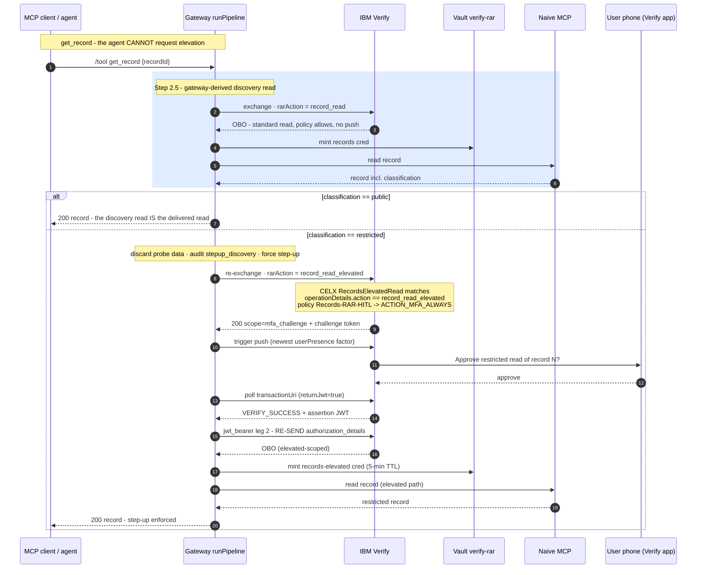

# Human-in-the-loop step-up

Two things happen here, and it matters that they are **separate**:

1. **Step-up is enforced by identity-provider *policy*, not by gateway code.**
2. **Classification discovery is *derived* by the gateway, so the agent cannot skip step-up.**

Confusing the two is how people build step-up that a clever agent walks around. Keep them apart.

## 1. Step-up is policy-enforced, not app-invented

The gateway **never decides** that MFA is needed. It builds the RAR, sends the exchange, and waits
to see what the IdP's access policy does with it. When the policy matches and returns
`scope=mfa_challenge` - which arrives as a **200 OK**, not an error - the gateway's job is only to
*sequence* the human checkpoint:

- **`triggerOAuthMfaPush()`** - look up the user's newest `userPresence` push factor and send a
  push naming the exact operation and record ("Approve: view a restricted record REC-9001. If you
  didn't request this, deny.").
- **`pollOAuthMfaStatus()`** - poll the `transactionUri` (`?returnJwt=true`, 3s × 120s by default)
  until success, denial, fraud, or timeout.
- **`exchangeMfaAssertionWithRAR()`** - the second leg: POST the approval assertion back as
  `grant_type=jwt-bearer`, **re-sending `authorization_details`**. Omit it and Verify mints an OBO
  with no attested RAR, and Vault would mint a credential unbound from the approved transaction.
  Re-sending is mandatory, not optional.

Because the *policy* decides, you change step-up behaviour by editing Verify policy - not by
editing gateway code that a fork could patch out. The mapping from tiers to policy rules is in
[step-up policies](../guides/step-up-policies.md). The point of principle: **enforcement you can
edit around is not enforcement.**

### The parked transaction is identity-bound

A `mfa_challenge` is parked in an in-memory `pending` store keyed by an **unguessable `txId`**;
the caller resumes it via `POST /hitl/complete`. That route is **identity-bound**: the caller's own
bearer is introspected and its `verifyUserId` must match the pending transaction's owner - checked
off a *non-destructive* peek, **before** any poll, deny-count, or session-kill side effect runs.

Why this is not optional: without it, `/hitl/complete` would only verify bearer *presence*. Any
holder of *any* valid bearer who learned another user's (unguessable, but leakable) `txId` could
`POST { txId, verdict: 'denied_suspicious' }` and force a **session-kill on that victim** - a
denial-of-service needing zero Verify interaction. The identity binding closes it with a
`403 forbidden` before the first side effect. (This was a security-review CRITICAL fix; the
`verdict` field is also a dev-only escape hatch gated behind `GATEWAY_ALLOW_TEST_VERDICT=1` - in
normal operation the verdict always comes from the real Verify poll.)

## 2. Classification discovery is gateway-derived

Here is the trap step-up usually falls into: if the *caller* tells you "this is a restricted record,
please step up," a compromised agent simply... doesn't. It asks for the normal path and the step-up
never fires. So for `get_record`, **the caller never requests elevation. The gateway decides,
server-side.**

The probe (`pipeline.ts` step 2.5) runs a cheap read with the **standard** RAR - which the policy
allows with no push - *purely to learn the record's `classification`*. Crucially, a restricted
record is **not returned from that read**: the gateway discards the probe data, audits it as
`stepup_discovery`, and re-runs the call with the elevated `record_read_elevated` RAR. That makes
the `RecordsElevatedRead` policy rule fire `ACTION_MFA_ALWAYS`, so the caller gets a genuine step-up.
**Because the agent cannot request elevation, it cannot dodge the step-up** by simply not asking for
the elevated path.

One load-bearing detail: `classification` lives inside the MCP `CallToolResult` envelope -
`content[0].text` is a JSON *string*, and the record is inside it. `shouldStepUp()` unwraps that
before evaluating the match rule. Get it wrong and every record looks public, so the gateway never
elevates and the step-up never fires - the "policy isn't being applied" bug that is actually a
parsing bug.

Which tools run the discovery probe, and which classification values elevate, are config:
[`config/rar.json → stepUp`](../../gateway/config/rar.json). The `elevateWhen` rule (`equals` / `in`
/ `notIn`) points at your domain's "sensitive row" field; `notIn` is the fail-closed safe-list -
elevate for anything NOT explicitly safe, including unknown levels - and the same mechanism protects
your data. See [step-up policies](../guides/step-up-policies.md#the-elevatewhen-match-rule).

## The consumer contract: `202 pending` is `res.ok`

This is the one thing every caller must get right, and it is worth stating bluntly:

> **A `202` is not a failure. Read the envelope, not the HTTP status.**

When a call comes back `202 { ok: false, pending: true, txId, pushInfo }`, the gateway is telling
you a human approval is in flight - a push has landed on the user's phone. The correct client
behaviour is to surface the approval prompt and, once the user taps approve, call
`POST /hitl/complete { txId }` with the **same user's bearer**. A caller that treats `202` as an
error and gives up doesn't compromise security - the record is withheld regardless - it just can't
complete step-up actions. A caller that treats `ok:false` as "the call failed" will show the user a
spurious error while their phone is buzzing.

Copy-paste handling for raw fetch, the MCP SDK, LangChain, and a Claude loop is in
[any-agent](../guides/any-agent.md). The envelope shapes are enumerated in the
[API reference](../reference/api.md).
