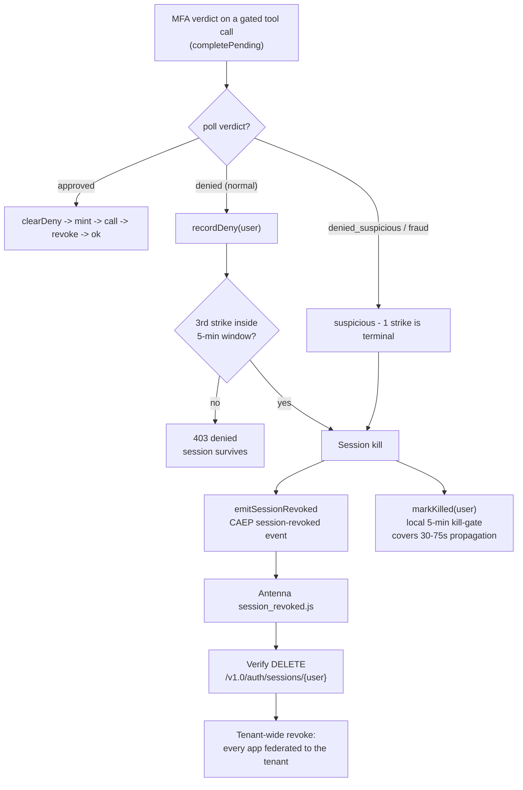

# Session kill - CAEP/SSF, two channels

A single denied step-up is a normal event; the user says no and the record is withheld. But
**repeated** denials, or an explicit "this is fraud" from the user's phone, are a different signal:
something is driving the agent that the user does not want. At that point the gateway escalates
from "deny this call" to "**kill this user's sessions, everywhere**."

The critical design point: the gateway only ever *emits* a CAEP event. It does **not** call the
IdP's session-delete API itself. A separate CAEP/SSF transmitter ("Antenna") owns that call. Two
channels, two jobs - keep them distinct.

## What escalates

- **Normal denial** (`ssf/deny-counter.ts`) - `recordDeny()` increments a per-user counter in a
  **5-minute rolling window**. The **3rd strike** trips the threshold. A user who legitimately
  fat-fingers one approval is not punished; a loop hammering step-up is.
- **Suspicious / fraud** - a "report suspicious" verdict from the phone is a **1-strike,
  immediately terminal** kill. The reasoning: a user who reports the agent as fraudulent should not
  be pestered with more pushes - take the strong action at once.
- **Approval clears the counter.** Proving the user still holds the MFA factor is a fresh slate -
  the counter resets (`clearDeny`). Note this only clears on **MFA-gated** tiers (2/3): a tier-1
  read succeeding must *not* reset the counter, or an agent could launder its strike count through
  harmless lookups between write attempts.

## Channel 1 - the security channel (the actual kill)

On a kill, `emitSessionRevoked()` (`ssf/antenna.ts`) POSTs a **CAEP `session-revoked` event** to
the transmitter. The transmitter's `session_revoked` handler is what calls Verify's
`DELETE /v1.0/auth/sessions/{verifyUserId}`, which terminates the user's sessions across **every
app federated to the tenant** - not just this gateway. That tenant-wide blast radius is the point:
if the agent is compromised, revoking only *this* app's session leaves the attacker holding the
user's session everywhere else.

The CAEP payload shape is exact and unforgiving. `sub_id` is **top-level** (not nested under
`events`); `event_timestamp` is **epoch seconds** (not milliseconds); `reasonAdmin.en` /
`reasonUser.en` must be present. Get any of these wrong and the ingester returns `201` and
**silently drops** the event - the session is never actually killed, and nothing tells you. The
handler reads `sub_id.verifyUserId` (older handlers fall back to SCIM-by-email, which is why the
email rides along when known). The exact shape lives in the `antenna.ts` header and
[step-up policies](../guides/session-kill.md).

## Channel 2 - the observability channel (and the local kill-gate)

Two more things happen in parallel with the CAEP emit, and both are about not-being-blind:

- **`markKilled(user)`** sets a **local 5-minute kill-gate**. A tenant-wide revoke is not
  instantaneous - there is a **30–75s propagation window** where Verify's `/oauth2/userinfo` might
  still 200 the just-revoked token. During that window the local gate 401s the *very next call*
  from that user immediately (pipeline step 0), so the gateway does not keep serving a session it
  just asked to have killed. Without this gate, the kill would have a several-second hole.
- **The central events dashboard push** (fire-and-forget). A real tenant-wide kill is otherwise
  *invisible*: the transmitter 201s, the Verify session dies, and nothing shows on a dashboard. So
  the gateway - the single kill choke point - also pushes an `agent:session_revoked` event to the
  webhook dashboard when `WEBHOOK_API_KEY` is set. This is the same principle as the
  [`_diagnostic` envelope](observability.md): **security you cannot see reads as broken.** A
  dashboard hiccup must never delay the real kill, so this push runs first and fire-and-forget.

## Why two channels, restated

The gateway *decides to escalate* (deny-counter + suspicious logic) and *emits*; the transmitter
*acts* (the session DELETE). Splitting them means the kill semantics (which app, which sessions, in
what order) live in one auditable transmitter handler you can reason about, and the gateway stays a
thin PEP that never becomes the tenant's session-management authority. Wiring the transmitter and
the dashboard is a task-shaped [guide](../guides/session-kill.md).
