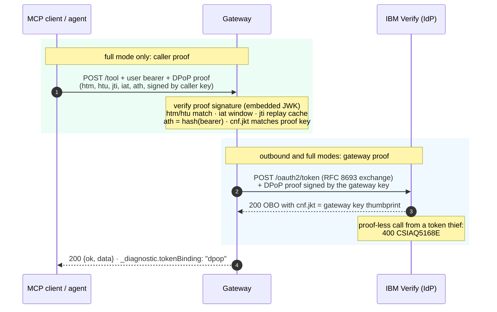

# Token binding with DPoP

Every token in this gateway is a bearer token by default. Whoever holds it can use it. Short lifetimes and immediate lease revocation shrink that window, but inside the window a stolen token works from anywhere.

DPoP (RFC 9449, Demonstrating Proof of Possession) closes that gap. The token gets bound to a private key at issuance, and every use of the token must carry a short-lived, signed proof built with that key. Steal the token without the key and it is inert.

You opt in. The default keeps the gateway exactly as it is today.

## The three modes

Set `TOKEN_BINDING_MODE` in the gateway's environment.

| Mode | What is bound | Who has to change | Use it when |
|---|---|---|---|
| `none` (default) | Nothing. Plain bearer everywhere. | Nobody. | You want drop-in behavior. |
| `outbound` | The OBOs Verify issues to the gateway. Every `/oauth2/token` call the gateway makes carries a proof, and the OBO comes back with `cnf.jkt` pinned to the gateway's key. | Nobody but you. Callers never see a difference. | You want hardening with zero client work. |
| `full` | Everything in `outbound`, plus the caller's own access token. Every request to `/tool`, `/hitl/complete`, `/me/audit`, `/me/session-status`, and `/mcp` must carry a caller-signed proof. | Every client of the gateway. | Your callers can sign proofs and you want a stolen user token to be worthless. |

## What full mode checks on every request

The gateway validates the `DPoP` header before anything else spends a network call:

1. The proof is a `dpop+jwt` JWS, signed by the public key embedded in its own header.
2. `htm` and `htu` match the method and URL the request actually used. Set `GATEWAY_PUBLIC_URL` to the URL your callers see. Behind a tunnel or load balancer that is the public hostname, not the local bind address.
3. `iat` is within a five-minute window of the gateway clock.
4. `jti` has not been seen before. Replays are rejected.
5. `ath` equals the SHA-256 hash of the access token in `Authorization`. The proof is for this token, not any token.
6. The access token's `cnf.jkt` claim matches the thumbprint of the proof's key. The token was issued to this key, and this request proved possession of it.

Any failure is a 401 with a specific error code (`missing_dpop_proof`, `proof_replayed`, `ath_mismatch`, `token_not_sender_constrained`, and friends). Nothing downstream runs.

## What DPoP does not cover here

Be clear-eyed about the boundary. The Vault leg (the OBO presented as `X-Vault-Token` to mint the ephemeral database credential) does not enforce `cnf.jkt` today. A stolen OBO is still usable at Vault for its remaining lifetime. Three things cap that exposure: the OBO lives minutes, the credential it mints is single-use with a 5-minute lease revoked right after the call, and the SSF kill switch revokes the whole session on abuse. Binding enforcement at Vault is on the roadmap upstream, not something this gateway can add from its side.

## Turning it on

Follow the order in the [rollout guide](../guides/dpop-rollout.md). The short version:

1. Re-run `npm run bootstrap:verify` with `ENABLE_DPOP=true`. This writes the enforcement fields on the Token Exchange app. String values, on purpose: the admin API ignores booleans.
2. Start the gateway with `TOKEN_BINDING_MODE=outbound`.
3. Run `npm run smoke:dpop`. It checks that OBOs carry `cnf.jkt` and, just as important, that a proof-less token call is rejected with `CSIAQ5168E`. If the negative probe passes traffic, enforcement is off no matter what the config claims.
4. For `full` mode, run the two tenant probes in the rollout guide first, then bootstrap with `ENABLE_DPOP_UI=true` and point a DPoP-capable client at the gateway.

## Verify-side reference

Three `additionalConfig` fields on the OIDC app control this, all string-typed:

| Field | Value | Effect |
|---|---|---|
| `dpopBoundAccessTokens` | `"true"` | Require a proof on token calls; issue `cnf.jkt`-bound tokens. |
| `validateDPoPProofJti` | `"true"` | Verify keeps its own jti replay cache. |
| `dpopProofSigningAlg` | `"RS256"` | Must match the key algorithm on the signing side. |

`CSIAQ5168E` ("The OAuth 2.0 Client requires a DPoP proof header") is the canonical signal that enforcement is real.
