# Bring your own MCP

The gateway ships secured for a "records" example domain. Retargeting it at *your* MCP server - a
tickets domain, an orders domain, a shipments domain - is **editing two JSON files and running two
bootstrap scripts. Zero application code.** This guide is the checklist, with a worked
`records → orders` example.

```mermaid
flowchart LR
    subgraph CORE["Generic core - ships unchanged (the product)"]
        direction TB
        C1["runPipeline - 6-step PEP"]
        C2["introspect · token-exchange · HITL step-up"]
        C3["vault mint / revoke"]
        C4["deny-counter · killed-sessions · antenna"]
        C5["audit chain · pending store"]
    end

    subgraph CFG["Per-domain config - swap to secure YOUR MCP"]
        direction TB
        S1["config/tools.json<br/>tier map (data, not code)"]
        S2["config/rar.json<br/>RAR vocabulary + role collapse"]
        S3["UPSTREAM_MCP_URL<br/>upstream MCP endpoint (env)"]
        S4["IdP: Verify TE app + access policy<br/>+ CELX attributes"]
        S5["Secrets: Vault verify-rar roles<br/>+ DB grants"]
    end

    CFG -. "injected via env + config + IdP/Vault trust" .-> CORE
    CORE ==> OUT["A newly secured domain<br/>same core, new trust config"]
```



## The five swappable surfaces

| # | Surface | Where | What you change |
|---|---|---|---|
| 1 | **Upstream MCP URL** | `UPSTREAM_MCP_URL` env | Point the south face at your naive MCP's `/mcp`. |
| 2 | **Tier map** | `gateway/config/tools.json` | `tool → { tier, rarAction, scope }` for each of your tools. |
| 3 | **RAR vocabulary** | `gateway/config/rar.json` | Your business RAR `type`, id field, actions, creds paths, step-up rule. |
| 4 | **IdP trust** | `bootstrap/verify.ts` (generated from 1–3) | Run it - the TE app, CELX attributes, and access policy are derived. |
| 5 | **Secrets-engine roles** | `bootstrap/vault.ts` (generated from 3) | Run it - one `verify-rar` role per creds path, plus the OAuth-RS entities. |

Surfaces 4 and 5 are **not hand-edited** - the bootstrap scripts *generate* every Verify and Vault
object from surfaces 1–3 (`bootstrap/lib/generate.ts`), which is exactly why the two config files
are the whole job. The honest long pole is the *trust provisioning* those scripts perform (STS
client, policy, Vault role, DB grants) - budget for that, not for code.

---

## Checklist

### ☐ 1. Aim the south face

Set the upstream URL to your naive server's MCP endpoint:

```bash
UPSTREAM_MCP_URL=http://your-naive-mcp:PORT/mcp
```

No code change - the OBO and the ephemeral DB creds are injected as per-call headers
(`Authorization`, `X-DB-Username`, `X-DB-Password`) the same way regardless of what's upstream.
Your MCP must read those DB-cred headers (that's how it receives the ephemeral credential); the
[example naive MCP](../../examples/naive-mcp/src/db.ts) shows the pattern.

**If the upstream owns `Authorization` itself** (a third-party SaaS MCP such as
`github/github-mcp-server` uses `Authorization: Bearer <PAT>` for its *own* API), do **not** let the
gateway put the OBO there - it would both `401` the upstream and leak IBM Verify's OBO to an audience
that must never receive it. Switch the auth mode:

```bash
UPSTREAM_AUTH_MODE=upstream_token   # default is `obo` (OBO in Authorization)
UPSTREAM_OBO_HEADER=X-Verify-OBO    # the OBO is relocated here (audit / a gateway-aware upstream)
UPSTREAM_AUTH_TOKEN=ghp_your_pat    # the UPSTREAM's own token, sent in Authorization
```

In `obo` mode the OBO rides `Authorization` (the example naive-mcp and any gateway-aware upstream read
it there). In `upstream_token` mode `Authorization` carries the upstream's token and the OBO moves to
`X-Verify-OBO`. Either way the gateway's authorization *decision* (introspect → tier → RAR → step-up →
SSF) still gates every call - only the forwarded credential differs per upstream.

**Fronting a NON-database upstream?** The Vault ephemeral-cred leg only makes sense when the upstream
actually queries a database with those creds. To put the gateway in front of a non-DB MCP (e.g.
GitHub's MCP, or the reference "everything" server), set:

```bash
UPSTREAM_DB_BACKED=false   # default is true; only the exact string "false" disables it
```

This **skips** the Vault mint/revoke leg and the `X-DB-*` headers entirely - the upstream is called on
the OBO alone. Everything else (introspect, tier gate, Token Exchange + RAR, HITL step-up, SSF kill,
audit) is unchanged. In this mode your `config/rar.json` actions need **no** `credsPath` (there is no
creds path to point at), and the RAR is reduced to just the business `operationDetails` element (the
two `vault:path_access` elements are dropped). This pairs naturally with
`UPSTREAM_AUTH_MODE=upstream_token` for a SaaS MCP that owns its own `Authorization`.

### ☐ 2. Write the tier map - `config/tools.json`

One entry per tool: its tier, the RAR action it maps to, and its OAuth scope.

```jsonc
{
  "get_order":       { "tier": 1, "rarAction": "order_read",   "scope": "orders:read"  },
  "list_orders":     { "tier": 1, "rarAction": "order_read",   "scope": "orders:read"  },
  "update_order":    { "tier": 2, "rarAction": "order_write",  "scope": "orders:write" },
  "refund_order":    { "tier": 3, "rarAction": "order_write",  "scope": "orders:write" },
  "delete_order":    { "tier": 4, "rarAction": "order_delete", "scope": "orders:write" }
}
```

| Tier | Meaning | Enforcement |
|---|---|---|
| 1 | Read | Token Exchange only - no step-up. |
| 2 | Write | Token Exchange + RAR; one policy-driven push. |
| 3 | Sensitive | Push **every** call. |
| 4 | Blocked | Denied at the gate - Verify is never contacted. |

Adding a tool is [its own short guide](add-a-tool.md).

### ☐ 3. Define the RAR vocabulary - `config/rar.json`

This is the file that says what your domain *is*:

```jsonc
{
  "rarType": "urn:acme:agent:orders",          // your business RAR type (CELX policy keys on it)
  "idField": "order_id",                        // key the domain id is nested under in operationDetails
  "argIdKey": "orderId",                        // the tool-call argument the id is read FROM
  "actions": {
    "order_read":          { "credsPath": "verify-rar/creds/orders",          "default": true },
    "order_read_elevated": { "credsPath": "verify-rar/creds/orders-elevated", "elevatedFrom": "order_read" },
    "order_write":         { "credsPath": "verify-rar/creds/orders-write" },
    "order_delete":        { "blocked": true }
  },
  "stepUp": { "discoveryTools": ["get_order"], "elevateWhen": { "field": "priority", "in": ["high", "urgent"] } }
}
```

The rules the loader validates at startup (a bad config throws a **named** `RarConfigError`, never a
mystery first-request failure):

- **exactly one** action sets `"default": true`, and it is not blocked - anything unmapped collapses
  onto it;
- every non-blocked action has a `credsPath`;
- every `elevatedFrom` references an existing action, and no two actions elevate from the same base;
- `stepUp.discoveryTools` are the tools that run the [server-derived classification
  probe](../concepts/human-in-the-loop.md), and `elevateWhen` is the declarative match rule on a read
  result that marks a row "sensitive" (here, `priority` **in** `["high", "urgent"]` instead of a
  `classification` safe-list).

That last block is how you protect *your* sensitive rows: point `elevateWhen.field` at whatever field
your system of record uses (with `equals` / `in` / `notIn` - `notIn` is the fail-closed safe-list),
list the read tool(s) that should probe for it, and the gateway forces step-up on a match - with the
agent unable to skip it. See [the elevateWhen match rule](step-up-policies.md#the-elevatewhen-match-rule).

### ☐ 4. Provision IdP trust - `bootstrap/verify.ts`

```bash
GATEWAY_APP_PREFIX="Orders Gateway" npm run bootstrap:verify
```

It generates and creates, from surfaces 2–3: the Token-Exchange app (with your scopes and the RAR
plumbing), the Agent Identity app, a UI app, the CELX attributes keyed on your `rarType` +
actions, and the access policy (deny → elevated MFA → write MFA → allow) bound to the TE app. It
prints every id and the `.env` lines to set. The [step-up policy guide](step-up-policies.md) explains
the generated rules.

### ☐ 5. Provision secrets-engine roles - `bootstrap/vault.ts`

```bash
npm run bootstrap:vault
```

It creates one `verify-rar` role per non-blocked creds path (`orders`, `orders-elevated`,
`orders-write`), each with a `rar_mappings` entry keyed `<rarType>|<action>` that GRANTs the
matching Postgres role, plus the two OAuth-RS entities the OBO resolves against (SUBJECT keyed by
the `agent_id` claim - one entity covers all users - and ACTOR keyed by the OBO's `act.sub`). Your
database needs the pre-baked `NOLOGIN` roles (`orders_read`, `orders_write`) the plugin grants to
each ephemeral user; adapt [`examples/db/vault-roles.sql`](../../examples/db/vault-roles.sql).

### ☐ 6. Register the north tool surface (only if clients use `/mcp`)

Clients on the REST `/tool` transport need **nothing** here. Clients using the real MCP `/mcp`
transport need each tool's `registerTool` + zod schema in `gateway/src/index.ts` so the MCP server
advertises it. This is the *one* place a new tool touches TypeScript, and it's a schema
declaration, not logic - see [add a tool](add-a-tool.md).

---

## What did *not* change

The entire pipeline - introspection, token exchange, RAR building, Vault mint/revoke, HITL
sequencing, the deny counter, the kill-gate, the CAEP emit, the audit chain - is untouched. You
changed *what the domain is*, not *how it's secured*. That separation is the product: the security
core is the small, stable part; the trust configuration is where your afternoon goes.

> The generated object names carry your `rarType`'s last segment as a prefix (e.g.
> `Orders-RAR-HITL`, `OrdersElevatedRead`). That's derived, not hand-authored - rename the `rarType`
> and the whole naming follows.
