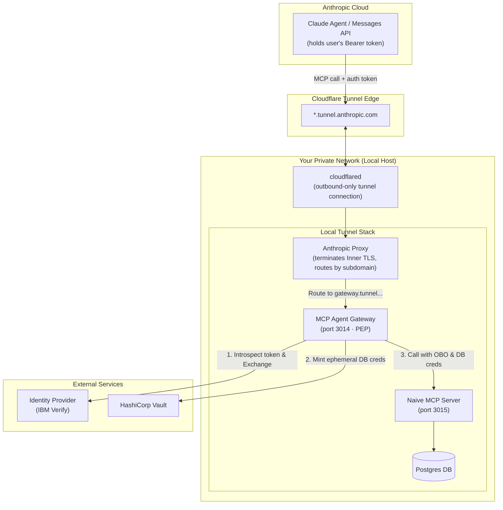

# Claude MCP Tunnels Integration Guide

This guide researches and outlines what it takes to run a native Claude Agent (either via the Messages API `mcp_servers` connector or via Claude Console Managed Agents) and connect it securely to the `mcp-gateway-verify-vault` security gateway using **Claude MCP Tunnels**.

---

## 1. Conceptual Overview

[Claude MCP Tunnels](https://platform.claude.com/docs/en/agents-and-tools/mcp-tunnels/overview) allow Claude (running in the Anthropic cloud) to communicate with Model Context Protocol (MCP) servers located inside a private network. 

Because the tunnel is outbound-only, you do not need to:
1. Open inbound ports in your firewall.
2. Expose the gateway or database to the public internet.
3. Allow-list Anthropic's IP addresses on your origin network.

### How it fits together
The **MCP Gateway** acts as a Policy Enforcement Point (PEP) between the incoming tunnel requests and the naive database-backed MCP server. 

---

## 2. Architecture

The network and request flow for a tunneled Claude integration is organized as follows:



In this layout:
- **Cloudflare** handles the secure outbound tunnel transport from your network to the Anthropic edge. Payload contents are protected by inner TLS.
- **Anthropic's Proxy** terminates the inner TLS certificate (signed by a CA you register in the Claude Console) and forwards the HTTP request to the Gateway on `http://127.0.0.1:3014`.
- **MCP Gateway** executes the 6-step authorization pipeline and acts as a barrier, only proxying calls to the **Naive MCP Server** on `http://127.0.0.1:3015` if the token exchange and step-up checks pass.

---

## 3. Authentication Setup

The gateway requires a valid user OIDC bearer token in the `Authorization` header to process tool calls. Depending on how Claude is hosted, the token is passed in one of three ways:

### Approach A: Messages API (Programmatic Agent)
When running your own agent loop that queries the Messages API, you supply the tunnel URL and the user's bearer token in the `mcp_servers` configuration.

```json
{
  "model": "claude-3-5-sonnet-latest",
  "max_tokens": 1024,
  "messages": [{"role": "user", "content": "Fetch record 902."}],
  "mcp_servers": [
    {
      "type": "url",
      "url": "https://gateway.YOUR_TUNNEL_DOMAIN/mcp",
      "name": "gateway",
      "authorization_token": "USER_BEARER_TOKEN"
    }
  ],
  "tools": [{"type": "mcp_toolset", "mcp_server_name": "gateway"}]
}
```
*Anthropic's client automatically forwards the `authorization_token` in the `Authorization: Bearer <token>` header to the tunnel proxy.*

### Approach B: Managed Agents Console (Static Token / Session Vault)
In the Claude Console, you can register credentials in a **Vault**. When creating a Managed Agent session:
1. Associate the session with the Vault containing the user's Bearer token.
2. Select your active tunnel.
3. Supply the subdomain `gateway` and the path `/mcp`.
4. Claude will automatically fetch the Bearer token from the Vault and inject it into requests routed to `https://gateway.YOUR_TUNNEL_DOMAIN/mcp`.

### Approach C: OAuth 2.1 with PKCE (Recommended for Production)
For user-level authentication in Managed Agents, Claude supports discovering OAuth authorization endpoints automatically via RFC 8414 metadata:
1. Configure Claude to authenticate directly with your IBM Verify tenant.
2. When the user starts a session, Claude redirects them to log in.
3. Claude obtains the access token, holds it securely, and passes it to the gateway tunnel.

---

## 4. The Human-in-the-Loop (HITL) step-up Challenge

The most critical integration puzzle is handling **MFA/HITL step-up challenges** (Tier 2 and Tier 3 tools).

### The Problem
By default, the gateway operates asynchronously:
1. If a tool requires elevation (MFA push), the gateway parks the request and returns `{ status: 'pending', txId: '...', pushInfo: '...' }` with an HTTP `202` status.
2. The user receives a push notification on their phone.
3. A client application must poll `POST /hitl/complete { txId }` with the user's bearer token to complete the transaction and fetch the result.

However, Claude's native `mcp_servers` connector expects **synchronous tool execution**. Once the tool request returns, the execution cycle is complete. Since Claude is an LLM running in the cloud, it cannot run arbitrary client-side loops to poll `/hitl/complete` and resume.

If the gateway returns `202 pending`, Claude receives that payload as the tool's text result, sees that the transaction is pending, and outputs a response like: *"I have sent a push notification to your phone. Please approve it."* 

Even if the user approves on their phone:
* **No resumption path:** There is no client-side driver to poll `/hitl/complete`.
* **New pushes:** If the user prompts Claude again ("I approved, try again"), Claude will call the tool from scratch, which starts a new pipeline execution and triggers a **new** push notification, resulting in an endless loop of pushes.

---

## 5. Solutions for HITL Resumption

To solve this, we have two distinct implementation designs:

### Solution 1: Synchronous HITL (Gateway-Side Blocking) — *Recommended*
Instead of returning `202 pending` immediately to the MCP client (Claude), the gateway's `/mcp` route can **block** the HTTP request, trigger the push, and poll IBM Verify for approval *server-side* within the request lifecycle.

```
Claude Agent           Tunnel Proxy          MCP Gateway            IBM Verify
     |                      |                     |                      |
     |--- callTool -------> |--- forward request> |                      |
     |    (Tier 2/3)        |                     |--- trigger MFA ----> | (Push sent)
     |                      |                     |                      |
     |                      |                     | <-- poll status ---- | (User approving...)
     |                      |                     | <-- poll status ---- | (Approved!)
     |                      |                     |                      |
     |                      |                     |--- Token Exchange -> |
     |                      |                     | <--- OBO Token ----- |
     |                      |                     |                      |
     |                      |                     |--- call naive tool ->| (Runs upstream)
     |                      |                     | <--- tool result ----|
     |<-- Tool Result ------|<-- Tool Result -----|                      |
     |    (200 OK)          |    (200 OK)         |                      |
```

* **Pros:** Complete "zero-code" compatibility for native Claude Agents. The agent experiences a slight delay (5-15 seconds while the user taps their phone) and then receives the successful tool payload.
* **Cons:** Keeps the HTTP connection open during MFA verification. We must ensure the timeout fits within Anthropic's tool execution threshold (typically 30 seconds).

### Solution 2: Asynchronous HITL with a Client-Side Orchestrator
If you run Claude using the Messages API in your own backend, you can write wrapper code to catch the `pending` envelope, coordinate the polling, and feed the final result back.

1. **Invoke Messages API:** Call Claude with the gateway tunnel.
2. **Handle response:** If the run stops on a tool call and receives `{ pending: true, txId: "..." }`:
   - Intercept the result.
   - Poll `POST /hitl/complete { txId }` using the user's bearer token.
   - Once approved, substitute the `pending` tool result with the actual data retrieved from `/hitl/complete`.
   - Submit the updated tool results block back to the Messages API to continue the run.

*Note: This is only possible if you are orchestrating the Messages API calls manually. It cannot be used in the hosted Claude Console (Managed Agents).*

---

## 6. Required Gateway Code Changes (for Solution 1)

To support native Claude integrations using **Synchronous HITL**, we can add a configuration flag `GATEWAY_SYNC_HITL` (or check an HTTP header `X-Gateway-Sync-Hitl`) and modify the gateway's core routing logic.

Here is the technical blueprint for the code changes:

### A. Modify `gateway/src/pipeline.ts`
We can update the `runPipeline` function to support an optional `syncHitl` flag. If a challenge is triggered, it will block and poll the Verify transaction internally.

```typescript
// Add to RunPipelineDeps / options:
export interface RunPipelineOptions {
  userToken: string;
  toolName: string;
  args: Record<string, unknown>;
  syncHitl?: boolean; // New flag
}

// Modify step 3 (Token Exchange leg) handling in runPipeline:
if (exchangeResult.status === 'mfa_challenge') {
  const txId = d.genTxId();
  const pushContext = d.buildPushContext(authorizationDetails);
  
  let transactionUri: string | undefined;
  try {
    transactionUri = await d.triggerOAuthMfaPush(exchangeResult.challengeToken, pushContext);
  } catch (err) {
    return { status: 'error', error: 'push_trigger_failed' };
  }

  // --- NEW: Synchronous HITL Leg ---
  if (syncHitl && transactionUri) {
    console.log(`[pipeline] Synchronous HITL triggered for txId: ${txId}. Polling Verify...`);
    
    // Poll Verify for user approval (up to 25 seconds to stay under HTTP timeouts)
    const pollResult = await d.pollOAuthMfaStatus(transactionUri, exchangeResult.challengeToken, {
      timeoutMs: 25000,
    });

    if (pollResult.state === 'approved') {
      console.log(`[pipeline] Synchronous HITL approved for txId: ${txId}. Resuming exchange.`);
      
      // Complete second-leg token exchange using the assertion
      const exchangeSecret = await getExchangeClientSecret();
      const secondLegResult = await exchangeMfaAssertionWithRAR(
        pollResult.assertion,
        gate.scope,
        authorizationDetails,
        exchangeSecret
      );

      if (secondLegResult.status === 'error') {
        return { status: 'error', error: secondLegResult.error };
      }

      // Mint credentials and call upstream tool
      const obo = secondLegResult.accessToken;
      let cred: MintedCred | undefined;
      if (d.dbBacked) {
        cred = await d.mintCred(obo, credsPath);
      }
      
      const upstreamResult = await d.callUpstreamTool(ctx.toolName, ctx.args, obo, cred);
      
      if (d.dbBacked && cred) {
        await d.revokeLease(cred.leaseId).catch(err => 
          console.warn('[pipeline] Post-sync-call revoke failed:', err.message)
        );
      }

      d.appendAudit({
        ts: d.now(), userId: verifyUserId, tool: ctx.toolName, tier: gate.tier,
        decision: 'approved', sub: verifyUserId, actChain: [SERVICE_NAME, verifyUserId]
      });

      return { status: 'ok', data: upstreamResult };
    } else {
      console.warn(`[pipeline] Synchronous HITL rejected or timed out: ${pollResult.state}`);
      return { status: 'denied', reason: `mfa_${pollResult.state}` };
    }
  }
  // --- END OF NEW LEG ---

  // Asynchronous default path (park in pendingCtx and return 202)
  const pendingCtx: PendingCtx = {
    verifyUserId, email: userEmail, challengeToken: exchangeResult.challengeToken,
    transactionUri, scope: gate.scope, authorizationDetails,
    toolName: ctx.toolName, credsPath, startedAt, args: ctx.args,
  };
  d.putPending(txId, pendingCtx);

  return { status: 'pending', txId, pushInfo: { ...pushContext, transactionUri } };
}
```

### B. Expose via Configuration
Enable this feature via an environment variable (`GATEWAY_SYNC_HITL=1`) or by checking the incoming transport header in `gateway/src/index.ts`:

```typescript
app.post('/mcp', async (req: Request, res: Response) => {
  const bearer = requireBearer(req, res);
  if (!bearer) return;

  // Read header to support dynamic client choice
  const syncHitl = req.header('x-gateway-sync-hitl') === 'true' || process.env.GATEWAY_SYNC_HITL === '1';

  const server = buildMcpServer(bearer, syncHitl);
  const transport = new StreamableHTTPServerTransport({ sessionIdGenerator: undefined });
  
  res.on('close', () => {
    transport.close();
    server.close();
  });
  await server.connect(transport);
  await transport.handleRequest(req, res, req.body);
});
```

---

## 7. Security Considerations

When using Claude Tunnels with the Gateway, observe these security boundaries:
1. **The Tunnel is NOT a Security Layer:** The Cloudflare tunnel secures the transport, but anyone inside your Anthropic workspace can call the tunnel URL. You **must** keep the `requireBearer` check active on the gateway, demanding the user's OIDC access token.
2. **Inner TLS Termination:** Ensure the Anthropic Proxy container is the only entity terminating the inner TLS certificate. Never share the private key of the certificate registered in the Claude Console.
3. **HTTP Connection Hold Timeouts:** Keep the synchronous polling timeout under 25 seconds. Open HTTP connections represent a potential denial-of-service vector if an attacker floods the gateway with un-approved step-up requests. Ensure rate limiting is configured at the Proxy level.
